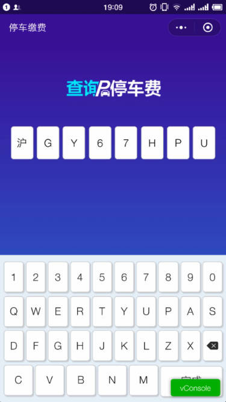

# mpvue-keyboard 基于 mpvue的小程序虚拟键盘组件

[](https://www.npmjs.com/package/mpvue-keyboard)
[](https://www.npmjs.com/package/mpvue-keyboard)

## 效果图



## API

| 名称              | 类型           | 默认值        | 描述               |
| -----------------|--------------- | ------------- | ----------------  |
| show        | Boolean         |     -         | 是否显示键盘  |
| title        | String         | -             | 自定义 标题  |
| base-border           | String         | #cccccc   | 自定义输入格子边框颜色  |
| active-border     | String       | #ff7149          | 自定义正在输入的格子边框颜色 |
| extra-key     | String       | 完成          | 右下角按键内容 |
| keyboard       | Function       | null          | 获取键盘输入结果 |


## Event

| 事件名              | 说明           | 参数        |
| -----------------|--------------- | ----------------  |
| keyboard        | 点击完成键时触发         |     key: 按键所选择的内容         |

## 基本使用方法

* 安装

``` bash
npm i mpvue-keyboard --save
```

* 使用

``` vue
<template>
    <keyboard :plateNum.sync="plateNum" @keyboard="keyboardChange" :show.sync="show" extraKey="立即支付" active-border="#6f85ff" base-border="#6f85ff"></keyboard>
    <button @click="bandChange">绑定无感支付</button>
</template>

<script>
import Keyboard from 'mpvue-keyboard';
export default {
    components: {
        keyboard: Keyboard
    },
    data() {
        return {
            plateNum: ''
        };
    },
    computed: {},
    methods: {
        keyboardChange(plate) {
            this.plateNum = plate;
        },
        async bandChange() {
            console.log(this.plateNum);
        }
    },
    mounted() {}
};
</script>


```